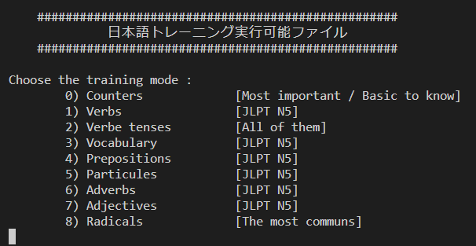

# Info

## Description

This repository helps you to train and aquire japanese language knowledge.

## UML

### Class diagram

# Mandatory

Install a TCL interpretor [Magicsplat](https://sourceforge.net/projects/magicsplat/files/magicsplat-tcl/).

# How to start

- Run the entry.tcl script and there you go.

        > tclsh entry.tcl

- Chose a training mode

# Utils

- If you want to exit a training program, instead of answering a question you write 'exit'
